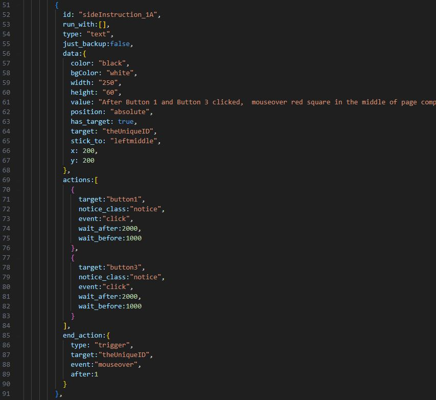
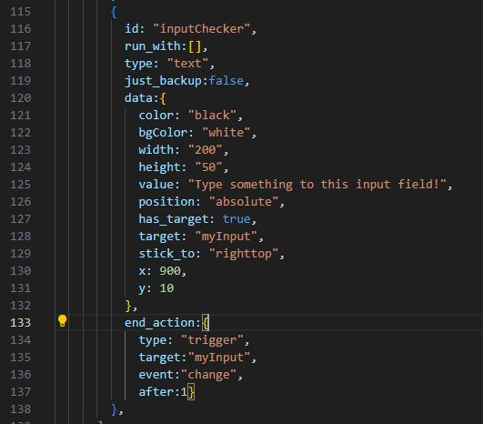

**Instructice: Creating Introductory Steps for Your Web App**

# Instructice: Creating Interactive Demonstrations for Your Web App
- You can try it [here](https://caglarorhan.github.io/instructice/)

### Table of Contents
1. [General Info](#general-info)
2. [Technologies](#technologies)
3. [Usage](#usage)
4. [Contributing](#contributing)
5. [Issues](#issues)
6. [License](#license)

### General Info
Instructice is a library that allows you to create interactive demonstrations for any web application. It is still in development, so is still very immature. It enables you to guide users through your application with user actions like events and information tooltips. All data and options are configurable through the `instructions.js` file.

## Usage
To use Instructice, you need to create an instructions.js file in your project. This file should export an object that defines the instructions for your demonstration. The instructions include various elements like text, images, buttons, and their associated actions. Each instruction can be configured to run with other instructions, have a backup, and end after a certain action or time.  Here's how to add instructice to our page:
``

``` 
<script type="module">
    window.onerror = function(message, source, lineno, colno, error) {
        if (error && error.code === "MODULE_NOT_FOUND") {
            console.error(`The module ${source} could not be found.`);
        }
    };

    import("./src/instructice.js")
        .then(module => {
            let Instructice = module.default;
            let instructice = new Instructice();
        })
        .catch(error => {
            console.error(`An error occurred while importing the module: ${error}`);
        });
</script>
```

- create an `instructions` object like below. 


```
let  instructions = {
      version: "1.0.0",
      for_url: "https://caglarorhan.github.io/instructice/",
      start_stop_switch: {
        is_switch_on:true
      },
      instructice_starter:{
        auto:false,
        from_app:false,
        id:"instructiceStarter",
        type:"img",
        class_name:"instructiceStarter",
        value:"./img/instructions.svg",
        title:"Click to practice with instructions!",
        alt:"Click to practice with instructions!"
      },
      instructice_stopper:{
        auto:false,
        from_app:false,
        type:"button",
        class_name:"instructiceStopper",
        value:"STOP THE INSTRUCTIONS",
        id:"stopButton",
        title:"Click to practice with instructions!",
        alt:"Click to practice with instructions!"
      },
      list: [
```

If there is a start-stop switch it will be used to start the instruction steps and if there is a stopper other than starter it can be used to stop the instructions.

If same element id given for both start and stop, it will switch the instruction start-stop.


*list* is an array of objects. Each object represents an element with one or multiple scenarios. These scenarios may solo or consecutive, they can have data (which is a text baloon for explanation as data next to the target element), can have actions and a stopper (end_action).



Elements scenarios might have no actions at all.



### Contributing
Contributions to Instructice are welcome. Feel free to fork the repository and submit a pull request. We also welcome any issues or suggestions for improvements.  

### Issues
If you encounter any problems or have any suggestions for Instructice, please feel free to open an issue on our GitHub repository. We appreciate your feedback and will do our best to respond to your concerns in a timely manner.

### License
Instructice is licensed under the MIT License. For more information, see the [LICENSE](./LICENSE.txt) file in the repository.
